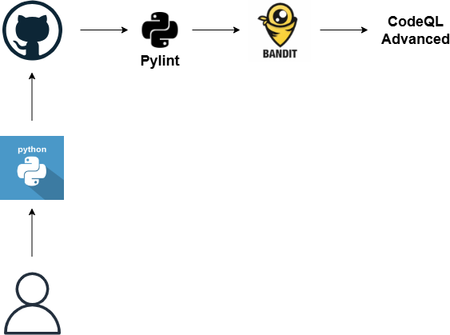

# A collection of small Python projects

- [BMI Calculator](./BMI_calculator) - A calculator that determines one's BMI.
- [Pizza Bill Calculator](./Pizza_bill_calculator) - A calculator that determines the total bill for the pizza based on user's input.
- [Rock, Paper, Scissors](./Rock_paper_scissors) - A rock, paper, scissors game.
- [Tip Calculator](./Tip_calculator) - A calculator that determines the bill of every participant in a group meal.
- [Treasure Map](./Treasure_map) - An RPG game.

## Architecture
